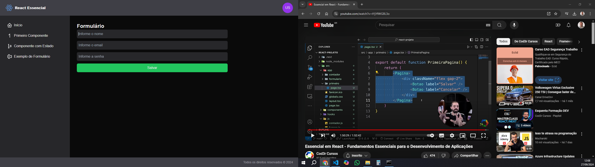

# **Projeto React**

Este repositório abriga um projeto animado construído com tecnologias modernas para uma experiência web fluida e visualmente atraente. Vamos dar uma olhada no que está cozinhando:

## **Tecnologias em Ação:**

- **React (JSX):** A biblioteca JavaScript usada para criar interfaces de usuário dinâmicas e componentizadas. JSX, uma extensão da sintaxe JavaScript, permite a escrita de código HTML dentro de JavaScript, tornando a criação de componentes intuitiva e eficiente.
- **TypeScript (TSX):** Um superconjunto de JavaScript que adiciona tipagem estática para melhorar a detecção de erros e a manutenção do código. Ele oferece a familiaridade do JavaScript com a segurança e a legibilidade do código aprimoradas pela tipagem.
- **Tailwind CSS:** Um framework CSS de baixo nível que fornece classes utilitárias para estilizar rapidamente elementos HTML. Tailwind permite a criação de interfaces responsivas e personalizadas de forma simplificada.

## **Arquivos-chave e Componentes:**

- **`Pagina.tsx`**: Define o layout base da aplicação.
- **`Home.tsx`**: O componente inicial que exibe uma saudação de boas-vindas.
- **`Botao.tsx`**: Cria um botão personalizável com texto ajustável.
- **`Contador.tsx`**: Um componente que implementa um contador com botões para incrementar e decrementar.
- **`Formulario.tsx`**: Gerencia um formulário para coleta de dados do usuário, com campos de nome, email, senha e um botão de salvar.
- **`useFormularioUsuario.tsx`**: Hook personalizado que lida com o estado do formulário do usuário, como nome, email, senha e a lógica de salvamento.

## **Estrutura Geral:**

A aplicação usa o conceito de componentes reutilizáveis para construir a interface. O componente `Pagina.tsx` provavelmente define o layout geral e aloca espaço para outros componentes, como `Home.tsx`, `Contador.tsx` e `Formulario.tsx`.

## **Para Executar:**

Para iniciar a aplicação localmente, certifique-se de ter o Node.js e o npm instalados. Siga estas etapas:

1. Clone o repositório para sua máquina local.
2. Abra um terminal ou prompt de comando e navegue até a pasta do projeto.
3. Execute `npx create-next-app@latest` para instalar as dependências necessárias.
4. Execute `npm install  @tabler/icons-react` para instalar os icones Tabler para React.
5. Execute `npm run dev` para iniciar o servidor de desenvolvimento.
6. Acesse `http://localhost:3000` (ou a porta especificada no script `dev` do `package.json`) em seu navegador para ver a aplicação em funcionamento.

## **Contribuindo:**

Se você deseja contribuir para este projeto, sinta-se à vontade para enviar pull requests! Certifique-se de seguir as diretrizes de contribuição existentes, se houver.
